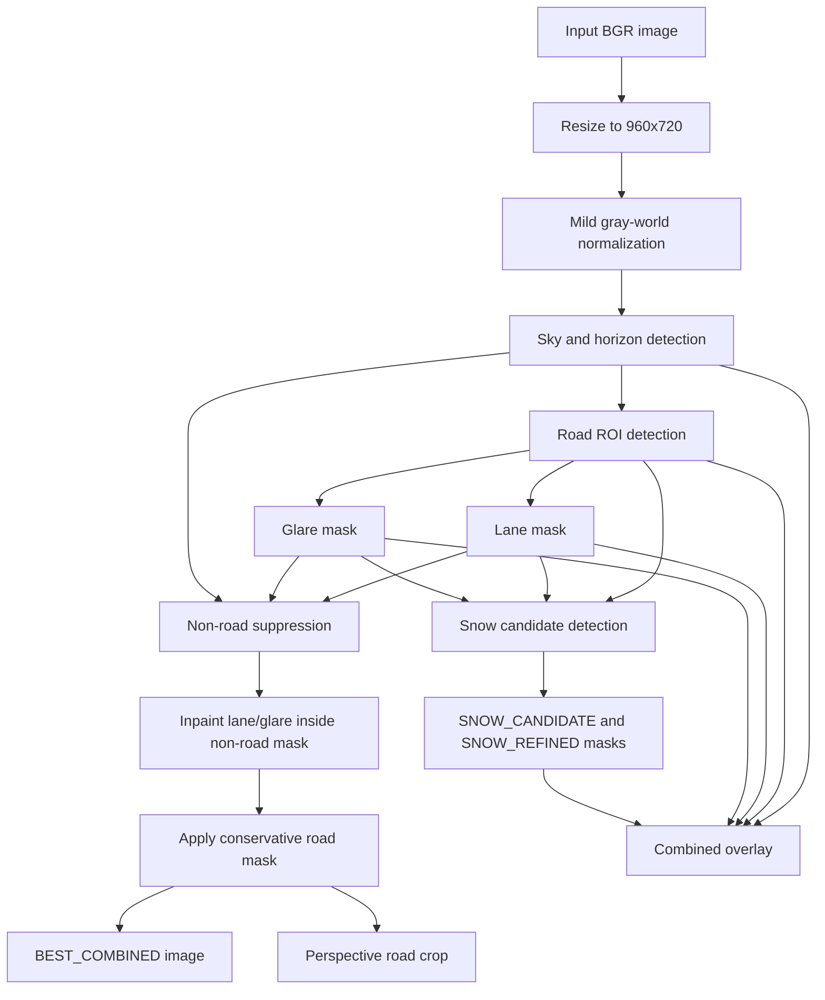

# SEG: Best Combination and Best Image Pipeline Documentation

Last reviewed: 2026-05-12

This document explains the implemented `best_combination` pipeline in this repository. It covers the practical purpose, source files, execution flow, intermediate masks, final `BEST_COMBINED` image, algorithmic rationale, thresholds, artifacts, limitations, and the literature that supports the classical computer-vision choices used here.

The document is intentionally detailed. It is written for both technical readers who need to modify the code and non-technical readers who need to understand what the output images and masks mean.

## 1. Scope

This file documents the pipeline implemented in:

- `pipelines/pipeline_best_combination.py`
- `pipelines/shared_context.py`
- `methods/*` modules used by `ensure_best_context`
- `batch/*` modules that run the pipeline and write artifacts
- `single_image_roi_visualization/*`, which is an isolated copied version used for one-image visual inspection

The top-level files and the `single_image_roi_visualization` copies were checked for the key pipeline files. At the time of writing, these copies match for the best-combination pipeline, shared context, configuration, and snow detection logic.

This is not a machine-learning segmentation system. There is no model, training, inference engine, learned detector, neural network, or pretrained weight file. The segmentation logic is entirely classical computer vision: color thresholds, geometry, edge/line detection, morphology, connected components, inpainting, and perspective warping.

## 2. Executive Summary

The best-combination pipeline builds a road-focused representation of a winter road-scene image. It tries to keep the drivable road surface, remove sky/background/side clutter, identify lane paint and glare so they do not get mistaken for snow, produce raw and refined snow masks inside the road ROI, and save a final cleaned image called `BEST_COMBINED`.

The final `BEST_COMBINED` image is produced by:

1. Resizing and mildly white-balancing the input.
2. Detecting sky and estimating a horizon row.
3. Detecting a conservative road ROI using horizon, vanishing point, a trapezoid prior, bottom-center road seed, Lab color consistency, and low-gradient support.
4. Detecting lane markings inside the road ROI.
5. Detecting glare/specular highlights inside the road ROI.
6. Suppressing non-road regions by intersecting the road ROI with a conservative drivable corridor.
7. Inpainting lane and glare pixels inside the retained road region.
8. Applying the conservative road/non-road mask so everything outside the kept road area becomes black.
9. Warping the road trapezoid to a square `ROAD_CROP` patch for a normalized road view.

The snow masks are generated as additional outputs, but the final `BEST_COMBINED` image is not a colored snow overlay. It is the cleaned road-focused image. The snow information is stored separately in `SNOW_CANDIDATE`, `SNOW_REFINED`, and the combined debug overlay.

## 3. Practical Problem Being Solved

Road snow classification is difficult in normal RGB camera images because several visual classes look similar:

- Snow, slush, salt residue, lane paint, glare, wet reflection, and overcast sky can all be bright and low-saturation.
- Vehicles and roadside snowbanks may be inside or near the visible road area.
- A fixed camera or vehicle camera often includes hood/dashboard pixels at the bottom.
- Snow-covered roads can have weak texture, weak lane markings, and very ambiguous road edges.

The pipeline addresses this by not trying to solve everything with one threshold. Instead, it decomposes the scene into several masks:

- sky/background mask
- road ROI mask
- lane paint mask
- glare mask
- raw snow candidate mask
- refined snow mask
- conservative non-road suppression mask

The best-combination output is the result of combining those masks in a conservative way.

## 4. Source File Map

### Main pipeline files

| File | Role |
| --- | --- |
| `pipelines/pipeline_best_combination.py` | Thin wrapper that calls shared-context construction and returns the best-combination artifacts. |
| `pipelines/shared_context.py` | Central reusable state machine. Builds and caches sky, road, lane, glare, snow, non-road, and final best-image outputs. |
| `pipelines/base.py` | Defines `PipelineResult` and `PipelineArtifact`, the containers used by all pipelines. |
| `config.py` | Stores all default thresholds, morphology settings, resize settings, dataset layout, output quality, and CLI-derived runtime config. |

### Method files used by the best pipeline

| File | Role |
| --- | --- |
| `methods/sky_detection.py` | Detects sky mask and horizon row. |
| `methods/horizon_detection.py` | Estimates horizon from near-horizontal Hough lines, with a vertical-gradient fallback. |
| `methods/road_region_detection.py` | Detects road ROI using geometry, seed region, Lab similarity, gradient filtering, and connected components. |
| `methods/vanishing_point.py` | Estimates vanishing point from left/right Hough line intersections. |
| `methods/ipm.py` | Builds the road trapezoid, rasterizes it, and warps the road patch. |
| `methods/lane_detection.py` | Detects white/yellow lane paint using HLS/HSV, gradients, Canny edges, and Hough line support. |
| `methods/specularity_detection.py` | Detects glare/specular highlights and produces an inpainted glare-suppressed image. |
| `methods/region_filters.py` | Suppresses non-road regions using a conservative road corridor and optional lane/glare inpainting. |
| `methods/snow_detection.py` | Generates raw and refined snow masks inside the road ROI while excluding sky, lane paint, and glare. |
| `methods/color_spaces.py` | Computes HSV, HLS, Lab, grayscale, Lab chroma, whiteness, and blue dominance helpers. |
| `methods/texture_features.py` | Computes Sobel gradient magnitude, local variance, Laplacian energy, approximate entropy, and colorized texture maps. |
| `methods/morphology_ops.py` | Provides opening, closing, hole filling, and mask refinement wrappers. |

### Utilities and batch execution files

| File | Role |
| --- | --- |
| `utils/image_utils.py` | Resize, gray-world normalization, grayscale conversion, map normalization, masking, median/percentile helpers. |
| `utils/mask_utils.py` | Binary mask conversion, morphology, component filtering, seed connectivity, mask ratios. |
| `utils/vis_utils.py` | Overlays, contours, horizon line, polygon and point drawing. |
| `utils/io_utils.py` | Unicode-safe OpenCV image read/write via `imdecode` and `imencode`. |
| `batch/process_dataset.py` | Scans images, selects pipelines, caches context across pipeline calls, writes artifacts, writes summary CSVs. |
| `batch/prefix_naming.py` | Defines artifact keys, output folders, filename prefixes, and output file types. |
| `batch/output_writer.py` | Writes artifacts into mirrored dataset folder hierarchy. |
| `batch/generate_summary_csv.py` | Writes per-image ratios and warning flags. |
| `single_image_roi_visualization/run_single_image_roi.py` | Runs the copied pipelines on one fixed image and builds a visual comparison grid. |

## 5. Input and Output Assumptions

### Input image format

Images are read through OpenCV as BGR arrays, not RGB arrays. This matters because the code uses `cv2.COLOR_BGR2HSV`, `cv2.COLOR_BGR2HLS`, `cv2.COLOR_BGR2LAB`, and `cv2.COLOR_BGR2GRAY`.

Supported dataset image extensions are:

- `.jpg`
- `.jpeg`
- `.png`
- `.bmp`
- `.tif`
- `.tiff`
- `.webp`

### Default working size

The default config resizes every image to:

```text
width:  960
height: 720
```

This happens in batch execution through `resize_and_normalize(image, cfg.resize_shape)`. The single-image visualization runner uses the same size.

### Color normalization

The preprocessing applies a mild gray-world normalization after resizing:

1. Convert image to `float32`.
2. Compute mean B, G, R values over all pixels.
3. Compute the global mean of those three channel means.
4. Scale each channel so its mean moves toward the global mean.
5. Clip back to `0..255` and convert to `uint8`.

Reason: winter road cameras can have strong color casts from sky, snow, camera auto-white-balance, headlights, low sun, and overcast lighting. The gray-world step is simple and deterministic. It does not make the image physically correct, but it reduces some global color bias before HSV/HLS/Lab thresholds are applied.

### Dataset layout

The batch processor expects the defined dataset branch by default:

```text
Dataset_Classes/
+-- 1 Defined/
    +-- train/
    +-- val/
```

Configured classes are:

- `0 Bare`
- `1 Centre_Partly`
- `4 Fully`
- `3 One_Track_Partly`
- `2 Two_Track_Partly`

The scanner tolerates class-name differences involving underscores, spaces, and dashes. For example, `1 Centre_Partly` can resolve to `1 Centre - Partly`.

## 6. Runtime Entry Points

### Batch run

Run only the best-combination pipeline:

```bash
python main.py --input Dataset_Classes --output outputs --pipeline best_combination
```

Run all pipelines:

```bash
python main.py --input Dataset_Classes --output outputs --pipeline all
```

Relevant CLI flags:

```bash
--resize-width 960
--resize-height 720
--max-images 100
--splits train val
--defined-folder "1 Defined"
--debug
```

Important implementation detail: `--no-intermediate` is parsed into `cfg.save_intermediate_outputs`, but the current batch writer writes every artifact returned by the selected pipeline. The best-only pipeline returns only the best-combination artifacts listed later in this document.

### Single-image visualization run

The single-image runner is:

```bash
python single_image_roi_visualization/run_single_image_roi.py
```

It uses:

```text
single_image_roi_visualization/input/capture_log_20251218_110045_123_IMG_2025-12-18_11-17-44.webp
```

It writes to:

```text
single_image_roi_visualization/outputs/
```

It runs all copied pipelines in this order:

1. `sky_removal`
2. `road_roi`
3. `lane_processing`
4. `shadow_detection`
5. `glare_detection`
6. `texture_maps`
7. `snow_candidates`
8. `object_suppression`
9. `superpixels`
10. `best_combination`

Then it writes a visual grid under `VISUAL_SUMMARY`.

## 7. Pipeline Architecture

The key design is `SceneContext` in `pipelines/shared_context.py`. It is a dataclass that stores the intermediate products for one image.

Fields include:

```text
image
sky_mask
horizon_row
road_mask
trapezoid
vanishing_point
lane_mask
glare_mask
glare_suppressed
shadow_mask
shadow_suppressed
snow_raw
snow_refined
nonroad_mask
nonroad_image
texture_map
entropy_map
gradient_map
superpixel_overlay
region_mask
road_patch
best_image
```

Each `ensure_*_context` function checks whether the relevant fields are already populated. If they are present, it reuses them. If not, it computes them. This allows multiple pipelines to run sequentially on the same image without recalculating everything.

### Best-combination call graph

The implemented `run_pipeline` for best combination does this:

```text
run_pipeline(image, cfg, ctx=None)
  build_base_context(image, cfg, ctx)
    detect_sky(...)
    detect_road_roi(...)
  ensure_best_context(ctx, cfg)
    ensure_nonroad_context(ctx, cfg)
      ensure_lane_context(ctx, cfg)
        detect_lane_mask(...)
      ensure_glare_context(ctx, cfg)
        detect_glare_mask(...)
      suppress_nonroad_objects(...)
    ensure_snow_context(ctx, cfg)
      ensure_lane_context(...)
      ensure_glare_context(...)
      detect_snow_candidates(...)
    build final best_image
    warp_trapezoid_patch(...)
  build PipelineResult artifacts
```

### Conceptual flow diagram



## 8. Detailed Implementation Walkthrough

### 8.1 Image normalization

Implemented in:

- `utils/image_utils.py`
- `batch/process_dataset.py`
- `single_image_roi_visualization/run_single_image_roi.py`

Batch processing reads the original image, resizes it to the configured shape, and applies gray-world normalization.

Why this matters:

- All default thresholds assume the resized working resolution.
- All downstream ratios are computed on the resized image, not the original pixel dimensions.
- Mild global color balancing helps thresholds behave more consistently across cameras and lighting conditions.

What it does not do:

- It does not undistort camera lenses.
- It does not correct perspective.
- It does not perform local illumination correction.
- It does not use learned color constancy.

### 8.2 Sky detection and horizon estimation

Implemented in:

- `methods/sky_detection.py`
- `methods/horizon_detection.py`

Outputs:

- `ctx.sky_mask`
- `ctx.horizon_row`

The sky detector combines several classical cues:

- top-of-image prior
- horizon estimate
- blue dominance
- HSV brightness/saturation
- Lab lightness/chroma
- Sobel gradient magnitude as a low-texture cue
- top-border connectivity
- morphological open/close and hole filling
- area filtering

Horizon estimation first tries to detect near-horizontal lines:

1. Convert to grayscale.
2. Blur with a 5x5 Gaussian kernel.
3. Run Canny edge detection with thresholds `60` and `150`.
4. Run probabilistic Hough line detection.
5. Keep near-horizontal lines where:
   - absolute slope is less than `0.18`
   - line midpoint is above `0.72 * image_height`
   - line length is greater than `0.10 * image_width`
6. Compute a weighted median of line midpoints, weighted by line length.
7. Clamp the horizon to `0.18 * h .. 0.68 * h`.

If no acceptable horizontal lines are found, it falls back to vertical-gradient structure:

1. Compute vertical Sobel response.
2. Average response over the center horizontal band `w/5 .. 4w/5`.
3. Smooth the row signal with a 31-pixel moving average.
4. Choose the strongest row between `0.18 * h` and `0.68 * h`.

The sky candidate region is then restricted by:

- `sky_top_ratio = 0.62`
- `horizon_row + 0.12 * h`
- at least the top `0.26 * h`

Pixels can become sky candidates if they satisfy blue-sky or overcast-sky heuristics:

- Blue-sky cue: blue channel exceeds max(green, red) by more than `sky_blue_margin`, enough brightness, not too saturated.
- Bright-overcast cue: high Lab lightness, low Lab chroma, enough HSV value.
- Low texture: Sobel gradient below the configured percentile from the top region.

The final sky mask keeps only components connected to the top border, removes pixels too far below the horizon, refines the mask morphologically, and removes tiny components.

Reason for this implementation:

- Sky can be blue or gray/overcast in winter data.
- A pure blue threshold would fail on cloudy images.
- A pure brightness threshold would confuse snowbanks, road snow, signs, and glare with sky.
- Top-border connectivity prevents isolated bright objects lower in the image from becoming sky.
- Horizon restriction prevents the mask from leaking deeply into the road.

### 8.3 Road ROI detection

Implemented in:

- `methods/road_region_detection.py`
- `methods/vanishing_point.py`
- `methods/ipm.py`

Outputs:

- `ctx.road_mask`
- `ctx.trapezoid`
- `ctx.vanishing_point`

The road ROI detector is conservative. It is designed to find the visible road corridor, not every possible road-adjacent surface.

#### Hood/dashboard cut

The function `estimate_hood_cut_row` searches for strong lower horizontal edges:

1. Compute vertical Sobel magnitude.
2. Average across the central horizontal band `w/8 .. 7w/8`.
3. Smooth with a 21-pixel moving average.
4. Search rows between `0.60 * h` and `0.94 * h`.
5. Use the first row above the 88th percentile as the hood/dash edge.
6. Clip to `0.68 * h .. fallback`, where fallback is based on `road_bottom_exclusion_ratio`.

The road detector later zeroes out rows at and below this hood cut. This prevents dashboard, hood, wipers, or vehicle body pixels from being counted as road.

#### Vanishing point

The vanishing point estimator:

1. Converts to grayscale and blurs.
2. Runs Canny with thresholds `70` and `170`.
3. Runs probabilistic Hough lines.
4. Separates candidate lines into left and right sets by slope sign.
5. Filters out too-short, nearly-horizontal, nearly-vertical, top-edge, and bottom-edge lines.
6. Keeps the eight longest left and right candidates.
7. Computes all pairwise intersections.
8. Keeps intersections within a broad valid area.
9. Returns median `x` and median `y` of intersections.
10. Falls back to image center at the horizon row.

This gives approximate road convergence. It does not require perfect lane detection.

#### Trapezoid prior

The road trapezoid is built by `estimate_road_trapezoid`:

- bottom row: `h * (1.0 - road_bottom_exclusion_ratio)`
- top row: `horizon_row + 0.05 * h`, clipped between `0.20 * h` and `bottom_y - 40`
- center x: vanishing-point x clipped to `0.35 * w .. 0.65 * w`
- bottom width: `corridor_bottom_width_ratio = 0.92`
- top width: `corridor_top_width_ratio = 0.22`

The road detector then modifies the lower trapezoid points so the bottom aligns with the hood cut.

Reason:

- Road geometry is usually trapezoidal in forward-facing images.
- A trapezoid prior stops the ROI from spreading into sky, shoulders, roadside snowbanks, buildings, and vehicles.
- The vanishing point lets the trapezoid shift if the road is not centered.

#### Bottom-center seed

The algorithm creates a seed rectangle near the lower-center road area:

- seed width ratio: `road_seed_width_ratio = 0.12`
- seed vertical start: `road_seed_y0_ratio = 0.60`
- seed vertical end: `road_seed_y1_ratio = 0.80`
- seed x center: vanishing point x clipped to `0.40 * w .. 0.60 * w`

If the seed is empty after intersection with the prior, a narrow fallback seed is placed around the image center.

Reason:

- The lower-center area is the most likely drivable road surface.
- Connected-to-seed filtering keeps candidate pixels connected to a plausible road area.
- This rejects disconnected regions that merely have road-like color.

#### Color and texture consistency

The road detector computes reference values inside the seed:

- Lab `L`
- Lab `a`
- Lab `b`
- Lab chroma
- grayscale intensity

Then each pixel is tested against:

- Lab `ab` distance from seed color
- Lab lightness distance from seed lightness
- chroma distance from seed chroma
- gradient below a road-prior percentile
- grayscale distance from seed gray value

Candidate pixels must remain inside the trapezoid prior and outside sky.

The final road mask is:

1. Morphologically refined.
2. Reduced to components connected to the seed.
3. Dilated slightly.
4. Intersected with the prior.
5. Area filtered.
6. Reduced to the largest component.
7. Converted to `0/255`.
8. Cleared below the hood cut.

Reason:

- Road may be asphalt, snow-covered asphalt, slush, wet pavement, or partially covered.
- Lab `a/b` and chroma are more stable than raw RGB for color similarity.
- Gradient filtering helps keep smoother road-like areas.
- Largest-component selection prevents disconnected clutter from surviving.

### 8.4 Lane-mask generation

Implemented in:

- `methods/lane_detection.py`

Output:

- `ctx.lane_mask`

The lane detector only searches inside the road mask.

It combines:

- HLS lightness for white lane markings.
- HSV hue/saturation/value for yellow lane markings.
- Sobel gradient magnitude.
- Canny edges.
- Probabilistic Hough line reinforcement.
- Morphological opening and dilation.
- Connected-component area filtering.

White lane candidate:

```text
HLS lightness > lane_white_l
HSV saturation < lane_white_s
HSV value > 150
```

Yellow lane candidate:

```text
lane_yellow_h_low <= HSV hue <= lane_yellow_h_high
HSV saturation > 70
HSV value > 110
```

Candidate pixels must also have enough gradient or Canny edge support and must be inside the road ROI.

Hough lines are filtered by slope:

- reject nearly horizontal: `abs(slope) < 0.15`
- reject extreme vertical/noisy: `abs(slope) > 8.0`

If Hough line support exists, the pixel candidate is intersected with a dilated line mask. This makes the final lane mask more line-like and less likely to include random bright blobs.

The mask is finally dilated and area-filtered. Components above 18 percent of the road area are rejected.

Reason:

- Lane paint is visually similar to snow because it is often bright and low-saturation.
- Lane paint should be separated so it is not counted as snow.
- The Hough step makes the detector prefer elongated lane-like structures.

### 8.5 Glare and specularity detection

Implemented in:

- `methods/specularity_detection.py`

Outputs:

- `ctx.glare_mask`
- `ctx.glare_suppressed`

The glare detector searches inside the road mask and outside sky.

It computes:

- HSV value `V`
- HSV saturation `S`
- Lab chroma
- local background brightness using Gaussian blur with `sigmaX=11`
- local contrast as `V - local_background`

The value threshold is adaptive:

```text
max(glare_v_min, percentile_92_of_road_V + 10)
```

A glare candidate must satisfy:

```text
inside road and not sky
V > adaptive threshold
S < glare_s_max
Lab chroma < 26
local contrast > glare_local_contrast
```

The mask is refined morphologically and filtered by area. Large components above 5 percent of road area are rejected.

If glare exists, OpenCV inpainting fills those pixels with surrounding content using `cv2.INPAINT_TELEA` and radius `3`.

Reason:

- Glare often appears as bright low-saturation pixels, similar to snow.
- Local contrast helps distinguish a specular highlight from a uniformly bright snowy surface.
- Inpainting reduces the visual effect of glare in the final best image.

### 8.6 Non-road suppression

Implemented in:

- `methods/region_filters.py`

Outputs:

- `ctx.nonroad_mask`
- `ctx.nonroad_image`

This step builds a conservative drivable corridor:

1. Estimate a road trapezoid from horizon and vanishing point.
2. Rasterize it to a corridor mask.
3. Intersect it with `road_mask`.
4. Remove sky.
5. Erode by size `3`.
6. Apply the mask to the image, filling everything else with black.
7. If lane and glare masks are present, inpaint lane/glare pixels inside the conservative mask.

Reason:

- The road detector may include too much side region in ambiguous snow scenes.
- Erosion pulls the retained area inward, reducing boundary clutter.
- Intersecting geometry and appearance makes the mask stricter than either one alone.
- Inpainting lane and glare artifacts makes the final representation more road-surface-focused.

Important: when running only `best_combination`, the intermediate `nonroad_suppressed` artifact is not saved. It is computed inside the context, but only the best pipeline artifacts are returned. If `object_suppression` is run separately or as part of `all`, `NONROAD_SUPPRESSED` is written.

### 8.7 Snow candidate detection

Implemented in:

- `methods/snow_detection.py`

Outputs:

- `ctx.snow_raw`
- `ctx.snow_refined`

Snow detection is restricted to:

```text
road_mask > 0
sky_mask == 0
lane_mask == 0
glare_mask == 0
```

This is one of the most important implementation choices in the project. Snow is not detected globally. It is detected only on the road ROI after excluding sky, lane paint, and glare.

The detector computes:

- HSV
- Lab
- grayscale
- Lab chroma
- Sobel gradient magnitude
- local variance

Adaptive thresholds are computed inside the valid road base:

- Lab lightness threshold: max configured `snow_l_min`, 60th percentile of road-base Lab L
- HSV value threshold: max configured `snow_v_min`, 60th percentile of road-base V
- gradient threshold: configured percentile of road-base gradient
- variance threshold: configured percentile of road-base variance

Raw snow candidate:

```text
inside road base
and (Lab L > l_threshold or HSV V > v_threshold)
and HSV S < snow_s_max
and Lab chroma < snow_chroma_max + 8
```

Refined snow candidate:

```text
raw candidate
and (gradient < grad_threshold or local_variance < var_threshold)
```

Then:

- raw mask is morphologically refined
- refined mask is morphologically refined
- refined mask is filtered by minimum snow component area

Reason:

- Snow tends to be bright, low-saturation, low-chroma, and often low-texture.
- Lane markings and glare can match brightness and saturation, so they are explicitly excluded.
- Texture cues help reject bright rough objects and lane edges.
- Component filtering removes small isolated specks.

### 8.8 Final best image creation

Implemented in:

- `pipelines/shared_context.py`, `ensure_best_context`

The final best-image step is short but important:

```python
best = ctx.nonroad_image.copy()
suppress_mask = cv2.bitwise_or(ctx.lane_mask, ctx.glare_mask)
suppress_mask = cv2.bitwise_and(suppress_mask, ctx.nonroad_mask)
if np.any(suppress_mask):
    best = cv2.inpaint(best, suppress_mask, 3, cv2.INPAINT_TELEA)
best = apply_binary_mask(best, ctx.nonroad_mask, fill_value=0)
ctx.best_image = best
```

Meaning:

- Start from the non-road-suppressed image.
- Combine lane and glare masks.
- Restrict that suppression mask to the retained road region.
- Inpaint lane/glare pixels if any exist.
- Reapply the conservative non-road mask so anything outside it is black.

Reason:

- Lane paint and glare are likely confounders for snow estimation.
- Inpainting them can create a cleaner road-surface representation for downstream inspection or processing.
- Reapplying the non-road mask prevents inpainting from leaking visible data outside the desired corridor.

### 8.9 Road crop

Implemented in:

- `methods/ipm.py`
- `pipelines/shared_context.py`

If a trapezoid exists, `warp_trapezoid_patch` warps the final best image into a square patch:

```text
default output_size = (512, 512)
```

It uses:

- `cv2.getPerspectiveTransform`
- `cv2.warpPerspective`

The crop is a simple inverse-perspective-style road patch, not a calibrated metric bird's-eye view. There is no camera calibration, no lens model, no ground-plane calibration, and no physical scale.

Reason:

- A normalized square crop is easier to visually compare across frames.
- It gives downstream processes a compact road-focused image.
- It removes much of the irrelevant sky/side context.

### 8.10 Combined overlay

Implemented in:

- `pipelines/pipeline_best_combination.py`
- `utils/vis_utils.py`

The combined overlay is for debugging and interpretation. It does not feed back into the algorithm.

Overlay order:

1. Start from original working image.
2. Sky mask: BGR color `(255, 128, 0)`, alpha `0.22`.
3. Road ROI contour: BGR color `(0, 255, 0)`, thickness `2`.
4. Lane mask: BGR color `(0, 255, 255)`, alpha `0.55`.
5. Glare mask: BGR color `(255, 0, 255)`, alpha `0.55`.
6. Refined snow mask: BGR color `(255, 255, 0)`, alpha `0.45`.

OpenCV uses BGR order, so these colors may not match intuitive RGB names exactly. For practical visual inspection, green contours indicate the road ROI, yellow/cyan-like fills indicate lane/snow depending on display interpretation, and magenta/pink indicates glare.

## 9. Best-Combination Artifacts

When running `--pipeline best_combination`, the returned artifacts are:

| Artifact key | Output folder | Prefix | File type | Meaning |
| --- | --- | --- | --- | --- |
| `best_combined` | `BEST_COMBINED` | `BEST` | image | Final cleaned, road-focused image. |
| `road_roi_mask` | `ROAD_ROI_MASK` | `ROADMASK` | mask | Binary road ROI mask. |
| `snow_candidate` | `SNOW_CANDIDATE` | `SNOWMASK` | mask | Raw snow candidate mask. |
| `snow_refined` | `SNOW_REFINED` | `SNOWREF` | mask | Morphologically refined and area-filtered snow mask. |
| `lane_mask` | `LANE_MASK` | `LANEMASK` | mask | White/yellow lane paint mask inside road ROI. |
| `glare_mask` | `GLARE_MASK` | `GLAREMASK` | mask | Specular highlight mask inside road ROI. |
| `combined_overlay` | `DEBUG_OVERLAYS` | `OVERLAY` | image | Multi-mask debug overlay. |
| `road_crop` | `ROAD_CROP` | `ROADCROP` | image | Perspective-warped square road patch from best image. |

Masks are written as PNG. Image outputs are written as JPG by default, unless the input extension is already `.jpg`, `.jpeg`, or `.png`, in which case the writer preserves that extension for image artifacts.

Default write quality:

- JPEG quality: `95`
- PNG compression: `3`

## 10. Artifacts Produced by Related Pipelines

When running `--pipeline all`, additional artifacts are produced by earlier pipelines:

| Pipeline | Main additional artifacts |
| --- | --- |
| `sky_removal` | `SKY_MASK`, `SKY_REMOVED`, `HORIZON_OVERLAY` |
| `road_roi` | `ROAD_ONLY`, `DEBUG_OVERLAYS/ROADOVL` |
| `lane_processing` | `LANE_OVERLAY` |
| `shadow_detection` | `SHADOW_MASK`, `SHADOW_SUPPRESSED`, `DEBUG_OVERLAYS/SHADOWOVL` |
| `glare_detection` | `GLARE_SUPPRESSED`, `DEBUG_OVERLAYS/GLAREOVL` |
| `texture_maps` | `TEXTURE_MAP`, `ENTROPY_MAP`, `GRADIENT_MAP` |
| `snow_candidates` | `DEBUG_OVERLAYS/SNOWOVL` |
| `object_suppression` | `NONROAD_SUPPRESSED` |
| `superpixels` | `SUPERPIXELS`, `REGION_MASKS` |
| `best_combination` | `BEST_COMBINED`, best masks, combined overlay, road crop |

Shadow detection, texture maps, and superpixels are available in the project but are not required by `ensure_best_context`. They are useful for inspection and auxiliary outputs.

## 11. Configuration Values

All defaults live in `config.py`.

### ThresholdConfig

| Setting | Default | Used by | Meaning |
| --- | ---: | --- | --- |
| `sky_top_ratio` | `0.62` | Sky | Limits sky search mostly to upper image. |
| `sky_blue_margin` | `8.0` | Sky | Required blue dominance over red/green. |
| `sky_low_texture_percentile` | `55.0` | Sky | Low-gradient threshold percentile for top region. |
| `sky_low_chroma` | `24.0` | Sky | Lab chroma limit for bright overcast sky. |
| `sky_min_lightness` | `135.0` | Sky | Lab L threshold for bright overcast sky. |
| `road_bottom_exclusion_ratio` | `0.22` | Road/IPM | Excludes lower portion likely to contain hood/dashboard. |
| `road_seed_width_ratio` | `0.12` | Road | Width of lower-center road seed. |
| `road_seed_y0_ratio` | `0.60` | Road | Seed vertical start. |
| `road_seed_y1_ratio` | `0.80` | Road | Seed vertical end. |
| `road_ab_distance` | `24.0` | Road | Lab a/b distance tolerance from seed. |
| `road_l_distance` | `90.0` | Road | Lab L and gray intensity tolerance. |
| `lane_white_l` | `168` | Lane | HLS lightness threshold for white paint. |
| `lane_white_s` | `118` | Lane | HSV saturation ceiling for white paint. |
| `lane_yellow_h_low` | `12` | Lane | Lower HSV hue for yellow paint. |
| `lane_yellow_h_high` | `40` | Lane | Upper HSV hue for yellow paint. |
| `glare_v_min` | `220` | Glare | Minimum HSV value for glare candidates. |
| `glare_s_max` | `70` | Glare | Maximum saturation for glare candidates. |
| `glare_local_contrast` | `12.0` | Glare | Required brightness over local background. |
| `shadow_ratio` | `0.72` | Shadow | Shadow value ratio against blurred illumination. |
| `shadow_ab_distance` | `24.0` | Shadow | Chromatic consistency tolerance for shadow. |
| `snow_l_min` | `150` | Snow | Minimum Lab lightness threshold. |
| `snow_v_min` | `170` | Snow | Minimum HSV value threshold. |
| `snow_chroma_max` | `28.0` | Snow | Maximum low-chroma threshold before tolerance. |
| `snow_s_max` | `86` | Snow | Maximum HSV saturation for snow candidates. |
| `snow_texture_percentile` | `68.0` | Snow | Percentile for gradient/variance texture thresholds. |
| `corridor_bottom_width_ratio` | `0.92` | IPM/Non-road | Trapezoid bottom width ratio. |
| `corridor_top_width_ratio` | `0.22` | IPM/Non-road | Trapezoid top width ratio. |
| `max_component_fraction` | `0.35` | Configured | Present in config; not used by the current best path. |

### MorphologyConfig

| Setting | Default | Meaning |
| --- | ---: | --- |
| `open_size` | `5` | Default opening kernel size for removing small foreground noise. |
| `close_size` | `11` | Default closing kernel size for filling small gaps. |
| `dilate_size` | `5` | General dilation setting; not every path uses this exact config value. |
| `erode_size` | `3` | General erosion setting; non-road suppression currently erodes by literal `3`. |
| `fill_size` | `7` | Configured fill setting; hole filling is performed by binary fill, not this size directly. |
| `min_component_area` | `180` | Minimum generic component size. |
| `min_lane_area` | `60` | Minimum lane component area. |
| `min_glare_area` | `40` | Minimum glare component area. |
| `min_shadow_area` | `90` | Minimum shadow component area. |
| `min_snow_area` | `120` | Minimum refined-snow component area. |

### ProjectConfig

| Setting | Default | Meaning |
| --- | ---: | --- |
| `resize_width` | `960` | Working image width. |
| `resize_height` | `720` | Working image height. |
| `jpeg_quality` | `95` | JPEG output quality. |
| `png_compression` | `3` | PNG compression level. |
| `debug` | `False` | Enables verbose logging. |
| `save_intermediate_outputs` | `True` | Parsed but not currently used to suppress returned artifacts. |
| `max_images` | `None` | Optional image cap. |
| `report_name` | `summary.csv` | Latest summary filename. |

## 12. Summary Metrics and Warnings

The batch processor writes summary rows after processing each image. It builds the final context and computes:

| Metric | Meaning |
| --- | --- |
| `sky_ratio` | Fraction of all pixels marked as sky. |
| `road_ratio` | Fraction of all pixels marked as road ROI. |
| `lane_ratio` | Fraction of road ROI pixels marked as lane. |
| `glare_ratio` | Fraction of road ROI pixels marked as glare. |
| `snow_ratio_within_road` | Fraction of road ROI pixels marked as refined snow. |

Warning flags are heuristic audit signals:

| Warning | Trigger |
| --- | --- |
| `low_sky_mask` | `sky_ratio < 0.01` |
| `low_road_mask` | `road_ratio < 0.04` |
| `large_road_mask` | `road_ratio > 0.80` |
| `sparse_lane_mask` | `lane_ratio within road < 0.0005` |
| `large_glare_mask` | `glare_ratio within road > 0.08` |
| `very_large_snow_mask` | `snow_ratio within road > 0.92` |

These warnings do not stop processing. They are intended to identify images that may need manual inspection.

## 13. Resume Behavior

Batch processing is resumable.

For a selected pipeline, progress is written to:

```text
outputs/REPORTS/progress_<pipeline>.csv
```

Completed image paths are read from this CSV before a run starts. Images already in the progress file are skipped. Each image is appended only after its pipeline outputs are written and its summary row is built.

At the end, the batch processor writes:

```text
outputs/REPORTS/summary_<pipeline>.csv
outputs/REPORTS/summary.csv
```

This matters for long runs: interrupted processing can be resumed without starting over.

## 14. Why the Best Pipeline Uses This Combination

### Why not threshold snow directly on the whole image?

Because sky, snowbanks, lane paint, glare, clouds, white vehicles, road signs, and snowy road surface can all be bright and low-saturation. A global snow threshold would create many false positives.

The implemented pipeline first restricts the search to the road ROI, then excludes lane paint and glare.

### Why detect sky before road?

Sky removal helps road detection in two ways:

- It prevents bright sky and horizon clutter from becoming road candidates.
- It bounds the road trapezoid and top-region priors.

### Why estimate a horizon and vanishing point?

Roads in forward-facing images have strong perspective geometry. Even approximate horizon and vanishing-point estimates help build a useful trapezoid prior. The code does not need a perfect vanishing point; it clips and falls back safely.

### Why use Lab chroma and HSV saturation/value?

Different color spaces expose different useful properties:

- HSV value helps detect brightness.
- HSV saturation helps detect whiteness and low-color snow/glare.
- HLS lightness helps detect lane paint.
- Lab lightness and chroma separate brightness and colorfulness in a way that is often more stable than raw BGR.
- Lab a/b distance helps compare road colors to the seed region.

### Why use morphology?

Classical thresholds are noisy. Morphology removes small specks, connects nearby regions, fills holes, and makes masks more usable for downstream measurement and visualization.

### Why use connected components?

Thresholds can create many disconnected blobs. Connected components allow the code to:

- keep only top-connected sky
- keep road candidates connected to the lower-center road seed
- keep the largest road region
- reject tiny snow/lane/glare components
- reject overly large lane/glare components

### Why inpaint lane and glare?

Lane markings and glare are not the desired road-surface appearance. Inpainting replaces those pixels using nearby image content, creating a cleaner road-focused image. This is not meant to create scientifically exact pixels; it is a practical preprocessing step.

### Why is shadow not included in `best_combination`?

The project has a shadow pipeline, but `ensure_best_context` does not call `ensure_shadow_context`. Current best-combination logic handles lane and glare as the main bright confounders for snow. Shadow correction is available as a separate pipeline output when running `shadow_detection` or `all`.

This is a reasonable design choice because shadow brightening can sometimes alter snow/road intensity relationships. Keeping it separate makes the best output more conservative.

## 15. Literature and Algorithmic Background

This section lists literature and documentation directly relevant to the implemented methods. The pipeline is not a direct implementation of any one paper. It is a practical classical-CV composition that uses ideas common in the literature.

### Edge detection

- Canny edge detection is used before Hough line detection in horizon, vanishing-point, and lane logic. The classic reference is John Canny, "A Computational Approach to Edge Detection," IEEE TPAMI, 1986, DOI `10.1109/TPAMI.1986.4767851`: https://doi.org/10.1109/TPAMI.1986.4767851
- OpenCV documentation for `cv.Canny` describes the function used by the implementation: https://docs.opencv.org/3.4/dd/d1a/group__imgproc__feature.html

Implementation connection:

- `methods/horizon_detection.py` uses `cv2.Canny(gray, 60, 150)`.
- `methods/vanishing_point.py` uses `cv2.Canny(gray, 70, 170)`.
- `methods/lane_detection.py` uses `cv2.Canny(gray, 70, 160)`.

### Hough line detection

- The Hough transform reference used for line and curve detection is Duda and Hart, "Use of the Hough Transformation to Detect Lines and Curves in Pictures," Communications of the ACM, 1972, DOI `10.1145/361237.361242`: https://doi.org/10.1145/361237.361242
- OpenCV documentation for `cv.HoughLinesP` explains the probabilistic Hough line segment detector used here: https://docs.opencv.org/3.4/dd/d1a/group__imgproc__feature.html

Implementation connection:

- Horizon detection uses Hough segments to find near-horizontal horizon structure.
- Vanishing-point detection uses Hough segments to find left/right road-like lines.
- Lane detection uses Hough segments to reinforce elongated lane markings.

### Sobel gradient

- The Sobel-Feldman operator is the historical basis for the 3x3 gradient operator. A common historical reference is Sobel and Feldman, "A 3x3 Isotropic Gradient Operator for Image Processing," Stanford AI Project, 1968, often cited through Duda and Hart. A citation listing is available here: https://www.scirp.org/reference/ReferencesPapers?ReferenceID=83629

Implementation connection:

- `compute_gradient_magnitude` computes Sobel x/y derivatives and combines them with `cv2.magnitude`.
- Sky detection uses gradient as a low-texture cue.
- Road detection uses gradient to avoid high-edge clutter.
- Snow detection uses gradient and local variance to refine bright candidates.

### Mathematical morphology

- Mathematical morphology for image analysis is classically associated with Jean Serra, "Image Analysis and Mathematical Morphology," Academic Press, 1982: https://openlibrary.org/works/OL18822610W/Image_Analysis_and_Mathematical_Morphology
- OpenCV morphology documentation explains erosion, dilation, opening, and closing as used here: https://docs.opencv.org/4.x/d9/d61/tutorial_py_morphological_ops.html

Implementation connection:

- `morph_open`, `morph_close`, `morph_dilate`, `morph_erode`, and `fill_holes` are used throughout mask cleanup.
- `refine_binary_mask` applies open, close, and hole filling.

### Connected components

- OpenCV `connectedComponentsWithStats` is used to label binary regions and filter them by area: https://docs.opencv.org/4.x/d3/dc0/group__imgproc__shape.html

Implementation connection:

- Sky: remove small sky components.
- Road: keep seed-connected and largest components.
- Lane/glare/snow: remove too-small or too-large components.

### Color spaces and color constancy

- OpenCV color conversion documentation describes the RGB/BGR conversions to grayscale, HSV, HLS, and CIE Lab used by the code: https://docs.opencv.org/4.x/de/d25/imgproc_color_conversions.html
- A classic reference related to gray-world color constancy is Buchsbaum, "A spatial processor model for object colour perception," Journal of the Franklin Institute, 1980, DOI `10.1016/0016-0032(80)90058-7`: https://doi.org/10.1016/0016-0032(80)90058-7

Implementation connection:

- `gray_world_normalize` mildly normalizes channel means.
- HSV, HLS, Lab, and grayscale are computed in `get_color_spaces`.
- Lab chroma is used for sky, road, glare, snow, and shadow logic.

### Perspective transform and road crop

- OpenCV `getPerspectiveTransform` computes the transform from four source trapezoid points to four destination points: https://docs.opencv.org/4.x/da/d54/group__imgproc__transform.html
- OpenCV `warpPerspective` applies the perspective transform: https://docs.opencv.org/4.x/da/d54/group__imgproc__transform.html

Implementation connection:

- `warp_trapezoid_patch` maps the road trapezoid to a `512x512` patch.

### Inpainting

- The best pipeline uses OpenCV Telea inpainting. The underlying paper is Telea, "An Image Inpainting Technique Based on the Fast Marching Method," Journal of Graphics Tools, 2004, DOI `10.1080/10867651.2004.10487596`: https://doi.org/10.1080/10867651.2004.10487596
- OpenCV documentation for `cv.inpaint` and `INPAINT_TELEA`: https://docs.opencv.org/master/d7/d8b/group__photo__inpaint.html

Implementation connection:

- Glare suppression inpaints `glare_mask`.
- Non-road suppression can inpaint lane/glare inside the conservative mask.
- Final best image inpaints lane/glare inside the non-road mask.

### Road detection and vanishing-point context

- Vision-based road detection often combines appearance, geometry, vanishing point, and context. A related road-region paper is "A Reliable Method for Detecting Road Regions from a Single Image Based on Color Distribution and Vanishing Point Location," Procedia Computer Science, 2015, DOI `10.1016/j.procs.2015.08.002`: https://doi.org/10.1016/j.procs.2015.08.002
- Bui, Saitoh, and Nobuyama, "Vanishing Point-Based Road Detection for General Road Images," IEICE Transactions, 2014, DOI `10.1587/transinf.E97.D.618`: https://doi.org/10.1587/transinf.E97.D.618
- Lu et al., "Vision Sensor-Based Road Detection for Field Robot Navigation," Sensors, 2015, DOI `10.3390/s151129594`: https://doi.org/10.3390/s151129594
- Alvarez et al., "Combining priors, appearance, and context for road detection," IEEE Transactions on Intelligent Transportation Systems, DOI listing: https://researchportalplus.anu.edu.au/en/publications/combining-priors-appearance-and-context-for-road-detection/

Implementation connection:

- This pipeline uses a practical version of the same general idea: geometry and appearance are combined rather than relying on color alone.

### Lane detection context

- Classical lane detection commonly combines edge detection, Hough line transforms, and color filtering. A recent discussion of Hough-transform lane-detection limitations is Huang and Liu, "Practical limitations of lane detection algorithm based on Hough transform in challenging scenarios," International Journal of Advanced Robotic Systems, 2021, DOI `10.1177/17298814211008752`: https://doi.org/10.1177/17298814211008752

Implementation connection:

- The lane logic is intentionally limited. It only needs a useful lane-confounder mask, not a full lane model.

### Shadow detection context

- The project includes a separate shadow pipeline. Shadow detection literature often uses chromaticity, intensity, texture, and region reasoning. See Murali, Govindan, and Kalady, "A Survey on Shadow Detection Techniques in a Single Image," Information Technology and Control, DOI `10.5755/j01.itc.47.1.15012`: https://doi.org/10.5755/j01.itc.47.1.15012
- Shadow detection in road images can exploit chrominance and illumination properties; see "Shadow Detection in Still Road Images Using Chrominance Properties of Shadows and Spectral Power Distribution of the Illumination," Sensors, 2020: https://www.mdpi.com/1424-8220/20/4/1012

Implementation connection:

- Shadow detection is implemented separately using dark-vs-local-illumination and chromatic consistency, but it is not part of the current best-combination output path.

### Superpixel and region partitioning context

- The project has an auxiliary superpixel pipeline. The primary SLIC reference is Achanta et al., "SLIC Superpixels Compared to State-of-the-Art Superpixel Methods," IEEE TPAMI, 2012, DOI `10.1109/TPAMI.2012.120`: https://doi.org/10.1109/TPAMI.2012.120

Implementation connection:

- `methods/superpixel_ops.py` uses `skimage.segmentation.slic` when available and a watershed-grid fallback otherwise.
- Superpixels are not required by `best_combination`, but they are part of the broader segmentation toolkit.

### Winter road-surface and snow-condition context

- Road surface condition monitoring is safety-relevant because snow, ice, water, and slush affect traction and controllability. A recent open-access context paper is Valme et al., "Road condition estimation using deep learning with hyperspectral images: detection of water and snow," Proceedings of the Estonian Academy of Sciences, 2024, DOI `10.3176/proc.2024.1.09`: https://doi.org/10.3176/proc.2024.1.09
- Older vehicle-camera work on road surface condition detection used image features for water and snow, including texture analysis for snow. See Yamada et al., "Road Surface Condition Detection Technique Based on Image Taken by Camera Attached to Vehicle Rearview Mirror," JSAE Review, 2005, TRID record: https://trid.trb.org/View/763163
- Snowy road surface segmentation is a known difficult setting for RGB cameras. See Vachmanus et al., "Semantic Segmentation for Road Surface Detection in Snowy Environment," 2018, listing: https://tohoku.elsevierpure.com/en/publications/semantic-segmentation-for-road-surface-detection-in-snowy-environ/

Implementation connection:

- This repository does not implement those learning-based approaches. It uses transparent RGB heuristics designed for preprocessing and inspection.

## 16. Technical Interpretation of Each Mask

### `road_roi_mask`

White pixels are road ROI. Black pixels are not road ROI. This mask is conservative and should be interpreted as "likely usable road corridor," not perfect semantic road segmentation.

A good mask usually:

- covers the visible road lane/corridor
- avoids sky
- avoids most roadside clutter
- avoids the dashboard/hood
- forms one main connected component

Common failure patterns:

- too wide on fully snow-covered roads
- too narrow if road is very dark or lane boundaries are weak
- shifted if vanishing-point estimate is poor
- may include vehicles if they are visually connected and road-colored

### `lane_mask`

White pixels are suspected lane paint. This is a confounder mask. It does not need to identify complete lanes. It only needs to catch enough lane paint to avoid counting it as snow.

Common failure patterns:

- sparse if lane paint is occluded by snow
- false positives on bright cracks, salt lines, or guardrail edges
- false negatives in low contrast or night conditions

### `glare_mask`

White pixels are suspected specular glare. It is designed for bright, low-saturation, locally high-contrast highlights inside the road ROI.

Common failure patterns:

- may miss broad uniform glare because local contrast is lower
- may confuse very bright snow sparkle with glare
- may fail if road mask misses the glare region

### `snow_candidate`

White pixels are raw snow candidates inside road ROI after excluding sky, lane, and glare. This mask is intentionally more inclusive than `snow_refined`.

Use it when:

- you want to see what the color/brightness snow heuristic initially selected
- you are tuning thresholds
- you want to diagnose why `snow_refined` is too small

### `snow_refined`

White pixels are refined snow candidates after texture filtering, morphology, and component filtering.

Use it when:

- you need the main road-snow mask
- you compute `snow_ratio_within_road`
- you inspect final snow coverage behavior

Common failure patterns:

- compacted snow and wet slush may be too dark or high-chroma
- bright lane paint can leak if lane mask misses it
- bright low-texture road glare can leak if glare mask misses it
- very textured dirty snow can be rejected by gradient/variance refinement

### `best_combined`

This is the final cleaned road-focused image. It is not a mask.

Interpretation:

- retained road corridor remains visible
- non-road areas are black
- lane/glare artifacts inside the road region may be inpainted
- it can be used as a compact visual preprocessing output

Do not interpret black pixels inside this image as "not snow" in a semantic sense. Black usually means "outside retained road corridor" or "masked away."

### `combined_overlay`

This is the main visual audit image. Use it to inspect whether the masks agree with the scene.

Look for:

- road contour matching actual road
- sky not leaking into road
- lane mask not overwhelming the road
- glare mask capturing only specular regions
- refined snow mask covering plausible road snow

### `road_crop`

This is a perspective-warped road patch from the final best image.

Interpretation:

- useful for normalized visual comparison
- not physically calibrated
- not a metric bird's-eye view
- can distort pixels if the trapezoid is inaccurate

## 17. Non-Technical Reading Guide

If you only want to understand whether the pipeline worked on a given image, inspect these outputs in this order:

1. `DEBUG_OVERLAYS/OVERLAY_<image>.jpg`
2. `ROAD_ROI_MASK/ROADMASK_<image>.png`
3. `SNOW_REFINED/SNOWREF_<image>.png`
4. `BEST_COMBINED/BEST_<image>.jpg`
5. `ROAD_CROP/ROADCROP_<image>.jpg`

The most important question is whether the road ROI is correct. If the road ROI is wrong, all downstream masks are less reliable. Snow is only searched inside that ROI.

The second most important question is whether lane and glare masks are reasonable. If lane paint or glare are missed, they can appear as false snow.

The third question is whether the refined snow mask is too strict or too loose. If raw snow looks good but refined snow is too small, the texture thresholds or morphology settings may be too strict.

## 18. Tuning Guide

### If sky leaks into the road

Consider:

- reduce `sky_top_ratio`
- increase `sky_min_lightness`
- reduce allowance below horizon in `detect_sky`
- inspect horizon overlay from `sky_removal`

Be careful: making sky too strict can leave bright sky pixels available to road or snow logic.

### If road ROI is too small

Consider:

- increase `road_ab_distance`
- increase `road_l_distance`
- widen `corridor_bottom_width_ratio`
- widen `corridor_top_width_ratio`
- inspect the lower-center seed placement
- inspect whether the hood cut is too high

Be careful: a larger road ROI may include roadside snowbanks and vehicles.

### If road ROI is too large

Consider:

- reduce `corridor_bottom_width_ratio`
- reduce `corridor_top_width_ratio`
- decrease `road_ab_distance`
- increase erosion in non-road suppression
- inspect whether sky mask missed overcast sky

Be careful: a too-small ROI can undercount snow.

### If lane paint is counted as snow

Consider:

- lower `lane_white_l`
- increase `lane_white_s` only if white lane paint has higher saturation
- widen yellow hue thresholds if yellow markings are missed
- inspect lane overlay

Be careful: lane thresholds that are too loose may suppress real snow tracks.

### If glare is counted as snow

Consider:

- lower `glare_v_min`
- increase tolerance by raising `glare_s_max`
- lower `glare_local_contrast` for broader glare
- inspect `GLAREMASK` and `GLAREOVL`

Be careful: overly broad glare masks can inpaint snow.

### If snow mask is too small

Consider:

- lower `snow_l_min`
- lower `snow_v_min`
- raise `snow_s_max`
- raise `snow_chroma_max`
- raise `snow_texture_percentile`
- lower `min_snow_area`

Be careful: loosening snow thresholds can include lane paint, glare, salt residue, and bright road.

### If snow mask is too large

Consider:

- raise `snow_l_min`
- raise `snow_v_min`
- lower `snow_s_max`
- lower `snow_chroma_max`
- lower `snow_texture_percentile`
- increase `min_snow_area`

Be careful: strict thresholds can miss dirty, shaded, compacted, or wet snow.

## 19. Known Limitations

The pipeline is transparent and deterministic, but it has real limitations:

- It cannot recognize objects semantically. Vehicles, cones, pedestrians, or signs are not detected by class.
- It cannot distinguish all forms of snow, ice, slush, salt, and wet road using RGB alone.
- It assumes road-like perspective geometry. Strong curves, intersections, side-looking cameras, and unusual camera angles can break the trapezoid prior.
- It assumes useful lower-center road seed pixels. If the lower center is blocked by a vehicle, hood, spray, or shadow, road detection can degrade.
- It may struggle in night scenes, severe glare, heavy snowfall, and low visibility.
- It does not use camera calibration, so the road crop is not metric.
- It does not estimate physical snow depth, friction, temperature, or ice.
- It is sensitive to threshold choices and camera exposure.
- It does not currently use temporal consistency across video frames.
- The best-combination path does not use the shadow correction output.

## 20. What "Classical-Only" Means Here

The project deliberately avoids ML. This has tradeoffs.

Advantages:

- easy to inspect and explain
- no training data required
- no model versioning
- no GPU requirement
- deterministic behavior for a given image and config
- thresholds can be changed directly

Disadvantages:

- weaker semantic understanding
- more brittle in unusual scenes
- requires manual tuning
- cannot learn from dataset variation
- limited ability to separate visually similar materials

This makes the pipeline suitable for transparent preprocessing, visual audit, dataset preparation, and baseline analysis. It is not a replacement for a validated semantic segmentation model if pixel-perfect semantic labels are required.

## 21. Related ROAD_ONLY Snow Coverage Estimator

The repository also includes:

- `estimate_road_snow_coverage.py`
- `batch/road_only_coverage.py`
- `methods/road_snow_coverage.py`

This is separate from `best_combination`. It processes images already written under `ROAD_ONLY`.

It:

1. Rebuilds a non-black ROI mask from `ROAD_ONLY`.
2. Keeps the largest road component.
3. Trims the hood/dashboard region.
4. Shrinks the road ROI laterally to focus on the inner road surface.
5. Computes snow candidates using whiteness, Lab lightness, HSV saturation/value, chroma, gradient, variance, and an Otsu threshold over whiteness.
6. Uses a grid of local regions to add support for snow decisions.
7. Reports `snow_coverage_percent`.

Default grid:

```text
region_rows = 18
region_cols = 24
```

Outputs:

- `REPORTS/road_snow_coverage.csv`
- `REPORTS/progress_road_snow_coverage.csv`
- `ROAD_SNOW_MASK`
- `ROAD_SNOW_OVERLAY`

Use this estimator when you already have `ROAD_ONLY` images and want a percentage. Use `SNOW_REFINED` and `snow_ratio_within_road` when you are inspecting the best-combination pipeline itself.

## 22. Verification Checklist for a New Dataset

For a new camera or dataset, review a small sample across all classes before processing everything:

1. Run `--max-images` on each split/class if possible.
2. Inspect `HORIZON_OVERLAY` if running `all`.
3. Inspect `ROADMASK` and `ROADOVL`.
4. Inspect `LANEMASK` and `LANEOVL`.
5. Inspect `GLAREMASK` and `GLAREOVL`.
6. Compare `SNOWMASK` and `SNOWREF`.
7. Inspect `BEST` for over-masking or under-masking.
8. Check `summary_<pipeline>.csv` warning flags.
9. Tune thresholds only after identifying which upstream mask fails.

The most common mistake is tuning snow thresholds when the real problem is the road ROI. Always inspect road ROI first.

## 23. Glossary

| Term | Meaning |
| --- | --- |
| BGR | OpenCV channel order: blue, green, red. |
| HSV | Hue, saturation, value color space. Useful for brightness and saturation thresholds. |
| HLS | Hue, lightness, saturation color space. Used here for white lane paint lightness. |
| Lab | CIE Lab-like color space from OpenCV. Used for lightness and chroma comparisons. |
| Chroma | Approximate colorfulness from Lab a/b channels. Low chroma means closer to gray/white/black. |
| ROI | Region of interest. Here, usually the road area. |
| Horizon row | Estimated image row where sky/background transition or road perspective is expected. |
| Vanishing point | Approximate point where road/lane lines converge in perspective. |
| Trapezoid prior | Geometric polygon representing expected road corridor. |
| Morphological opening | Erosion followed by dilation; removes small foreground noise. |
| Morphological closing | Dilation followed by erosion; fills small gaps and holes. |
| Connected component | A contiguous group of positive pixels in a binary mask. |
| Inpainting | Filling selected image regions from neighboring pixels. |
| Refined snow | Snow candidate mask after texture filtering, morphology, and component filtering. |
| Best image | Final cleaned road-focused image written under `BEST_COMBINED`. |

## 24. Key Takeaways

- The best-combination pipeline is a staged classical-CV pipeline, not a learned segmentation model.
- The road ROI is the foundation. If it is wrong, snow results are unreliable.
- Lane and glare masks exist mainly to prevent false snow detections.
- `BEST_COMBINED` is a cleaned road-focused image, while `SNOW_REFINED` is the main snow mask.
- The implementation favors conservative, inspectable behavior over aggressive segmentation.
- Literature support comes from established edge detection, Hough transforms, morphology, color spaces, inpainting, road geometry, and winter road-condition image-analysis work.
